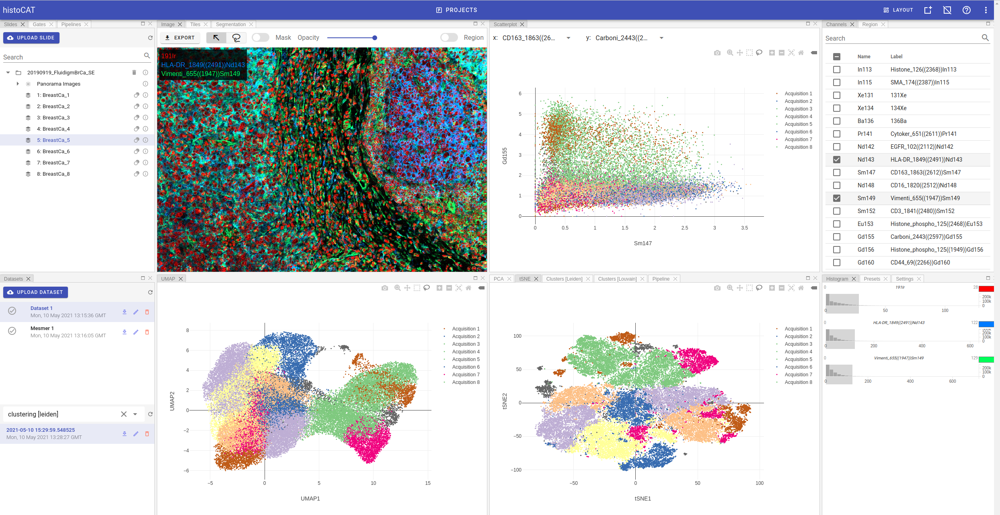

## Overview

Histology Topography Cytometry Analysis Toolbox (*histoCAT*) is a web platform to visualize and analyse multiplexed image cytometry data interactively.

If you want to use desktop applications with similar functionality, there are two versions available:

* **MATLAB edition**: [https://github.com/BodenmillerGroup/histoCAT](https://github.com/BodenmillerGroup/histoCAT)
* **histoCAT++ for Mac**: [https://github.com/BodenmillerGroup/histoCAT3D](https://github.com/BodenmillerGroup/histoCAT3D)

## Resources

Code: [https://github.com/BodenmillerGroup/histocat-web](https://github.com/BodenmillerGroup/histocat-web)

Documentation: [https://bodenmillergroup.github.io/histocat-web](https://bodenmillergroup.github.io/histocat-web)

Issue tracker: [https://github.com/BodenmillerGroup/histocat-web/issues](https://github.com/BodenmillerGroup/histocat-web/issues)

## Authors

- [Anton Rau](mailto:anton.rau@uzh.ch) (main author)

## Contributing

Pull requests are welcome. Please make sure to update documentation as appropriate.

For major changes, please open an issue first to discuss what you would like to change.
