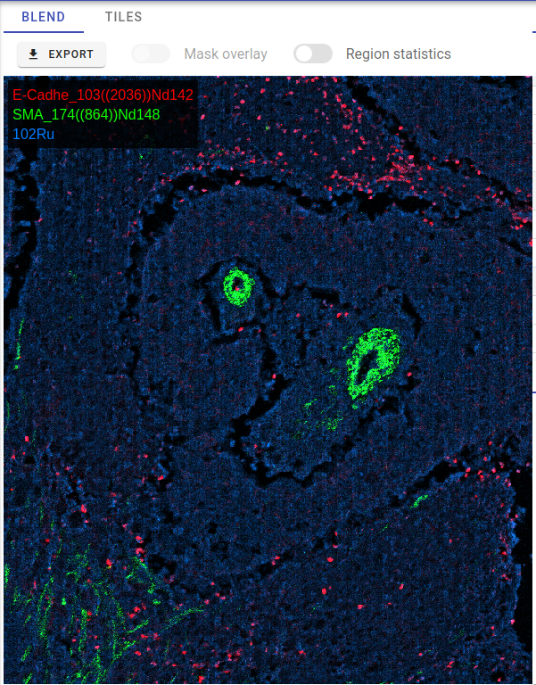
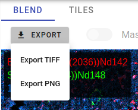
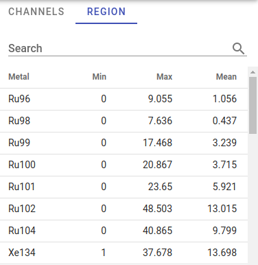

# Blend View

Blend image view is used to visualize channels selected in the Channels view. Zoom/panning functionality is supported.

Blend images can be exported in TIFF or PNG formats by clicking Export button:  

One useful feature is to get channels statistics for a selected region. To activate this behavior, please switch **Region statistics** checkbox and then select some area on the blend image view using mouse holding _SHIFT_ key. As soon as you release left mouse button, you will get general statistics \(min/max/mean intensities\) for the selected area for all available channels. This information is displayed in Region tab at the top right part of the screen:

