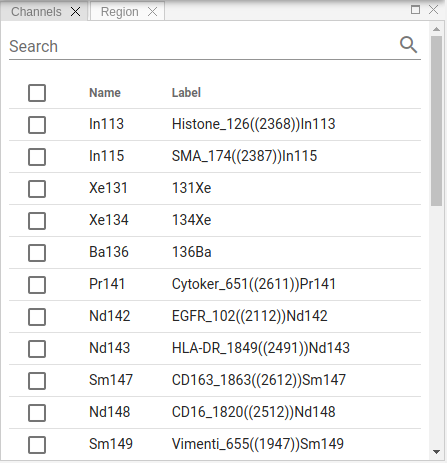
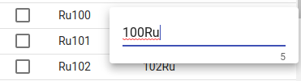

# Channels View

As soon as an acquisition is selected in the workspace view, the channel list will be populated. The channel list displays all channels acquired for the selected acquisitions.

Select one or more channels from the list to activate blend image viewer. You can sort rows in the channel table, search for specific entries or change custom labels by clicking on it:

!!! info "Info"
    Channel labels changes are global, i.e. visible to all users as they are stored in the database, not locally.
