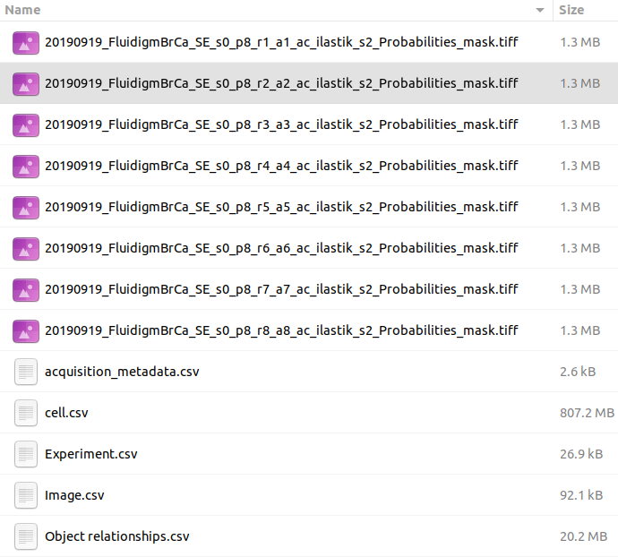
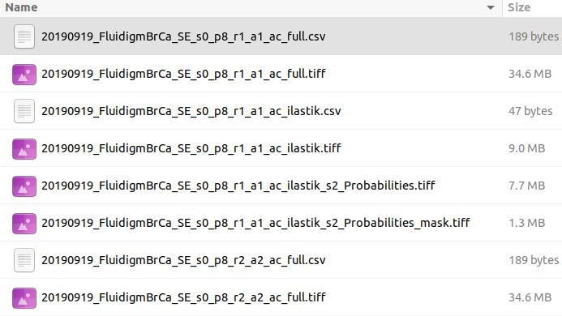

# Overview

Data mode allows to run data analysis pipelines on single-cell data. The main concept here is a **Dataset**: at the moment of the writing, this is an output of ImcSegmentationPipeline, but it can change in the future.

!!! info "Info"
    ImcSegmentationPipeline: A flexible image segmentation pipeline for heterogeneous multiplexed tissue images based on pixel classification. For more details please see [https://github.com/BodenmillerGroup/ImcSegmentationPipeline](https://github.com/BodenmillerGroup/ImcSegmentationPipeline)

Before uploading dataset to histoCAT, there are some additional steps users need to do. Output of the ImcSegmentationPipeline should contain the folder called **cpout** (i.e. CellProfiler output). Here is an example of a content in such folders:

By default this folder misses one important piece - channel order information. The easiest way to fix it at the moment is to manually copy a single file with channel order information from another folder, which is **tiffs** folder with the content similar to the following:

You may see there several CSV files with _\_ac\_full.csv_ suffix. Just copy one of these files into **cpout** folder. This file will be used by histoCAT to find out about channel order information when you upload dataset. In order to upload the dataset, please create a **ZIP** archive of the before-mentioned **cpout** folder (with included _\_ac\_full.csv_ file) and then upload it to histoCAT.
