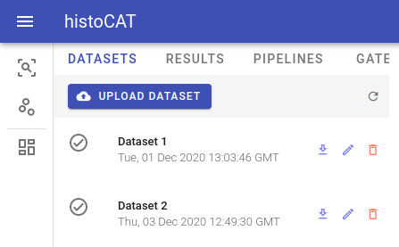
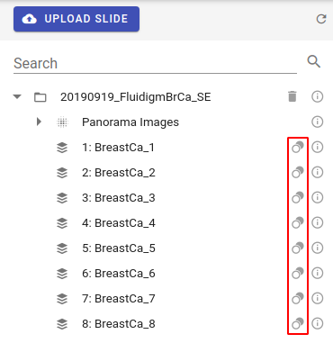
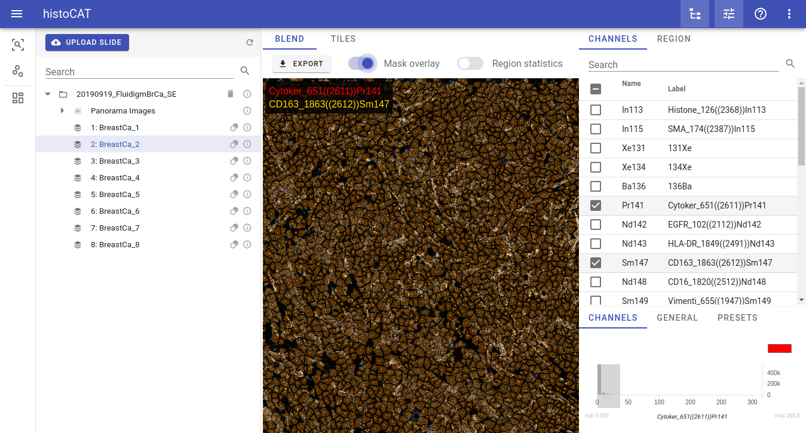

# Datasets

To upload zipped dataset file please click **Upload Dataset** button, which is active in Data mode and located in Datasets panel.

!!! info "Info"
    Processing of the uploaded dataset files can take some time. As soon as processing is complete, dataset name will appear in Datasets list and popup notification message will be displayed.

histoCAT stores preprocessed datasets and all analysis results in AnnData file format, see details at [https://anndata.readthedocs.io](https://anndata.readthedocs.io). You can download these AnnData files by clicking **Download** button in dataset view: 

There are other commands available for each dataset as well: **Rename** and **Delete**.

When you select dataset from the list, cell masks will become available for visualization in Blend image view. Acquisitions that have available mask information will be marked by the mask icon:   

If such acquisition with mask icon is selected in the Workspace view, then **Mask overlay** button will be enabled so one can switch it on to see according mask overlay in the Blend image view:

!!! warning "Warning"
    Don't forget: dataset should be selected in order to see mask overlay or start data analysis pipeline!
