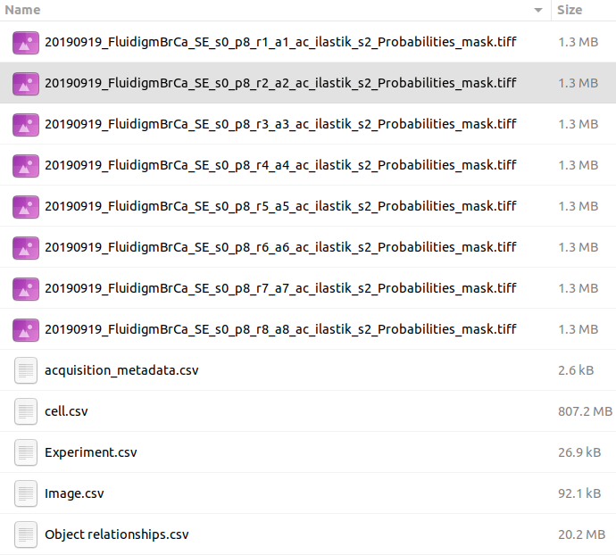
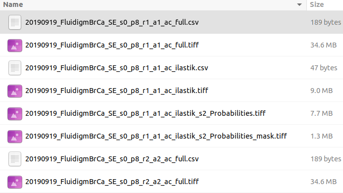

# Datasets

Datasets combine segmentation masks and single-cell measurements (mean cell intensities and centroids coordinates).
There are several ways to acquire datasets in histoCAT Web: one can import an output of separate IMC pipeline processing or generate cell-specific data by running deep-learning segmentation algorithm. 

As soon as dataset is ready, user can analyse single-cell data, e.g., perform dimensionality reduction, run cluster analysis, etc.

histoCAT Web stores raw datasets and its processed analysis sub-sets in AnnData file format, see details at [https://anndata.readthedocs.io](https://anndata.readthedocs.io).
You can download these AnnData files by clicking **Download** button in dataset view: 

There are other commands available for each dataset as well: **Rename** and **Delete**.

When you select dataset from the list, cell masks will become available for visualization in Image view.
Acquisitions that have available mask information will be marked by the mask icon:   

When such acquisition with the mask icon selected in the Slides view, then **Mask overlay** button will be enabled so one can switch it on to see according mask overlay in the Blend image view:

!!! warning "Warning"
    Don't forget: dataset should be selected in order to see mask overlay or start data analysis pipeline!

## Importing datasets

In order to import existing dataset, please click `UPLOAD DATASET` menu and select a proper option:

!!! info "Info"
    Processing of the uploaded dataset files can take some time. As soon as processing is complete, dataset name will appear in Datasets list and popup notification message will be displayed.

At the time of writing, four dataset import options are available. Let's describe each option separately.

### steinbock

histoCAT Web is able to import a zipped output of [steinbock](https://github.com/BodenmillerGroup/steinbock) multi-channel image processing framework.

!!! warning "Warning"
    Please keep in mind, that [directory structure](https://bodenmillergroup.github.io/steinbock/specs/directory-structure.html) may differ if user provided custom names when running `steinbock` pipeline. 

File upload dialog gives an option to define custom directory names when importing `steinbock` datasets:

### ImcSegmentationPipelineV1

[ImcSegmentationPipeline](https://github.com/BodenmillerGroup/ImcSegmentationPipeline): A flexible image segmentation pipeline for heterogeneous multiplexed tissue images based on pixel classification.
For more details please see [https://github.com/BodenmillerGroup/ImcSegmentationPipeline](https://github.com/BodenmillerGroup/ImcSegmentationPipeline)

Before uploading dataset to histoCAT, there are some additional steps users need to do. Output of the ImcSegmentationPipeline should contain the folder called **cpout** (i.e. CellProfiler output). Here is an example of a content in such folders:

By default, this folder misses one important piece - channel order information. The easiest way to fix it at the moment is to manually copy a single file with channel order information from another folder, which is **tiffs** folder with the content similar to the following:

You may see there several CSV files with _\_ac\_full.csv_ suffix. Just copy one of these files into **cpout** folder. This file will be used by histoCAT to find out about channel order information when you upload dataset. In order to upload the dataset, please create a **ZIP** archive of the before-mentioned **cpout** folder (with included _\_ac\_full.csv_ file) and then upload it to histoCAT.

### ImcSegmentationPipelineV2

ImcSegmentationPipeline v2 has some changes in the output format.
For details, please see official [changelog](https://github.com/BodenmillerGroup/ImcSegmentationPipeline#changelog).

Zip file content should have the following folder structure:

