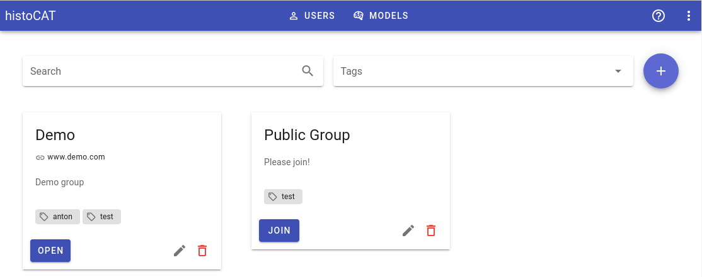
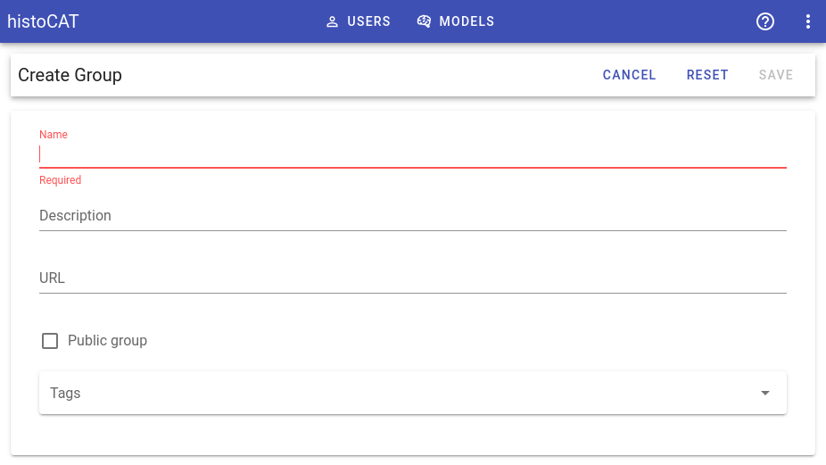
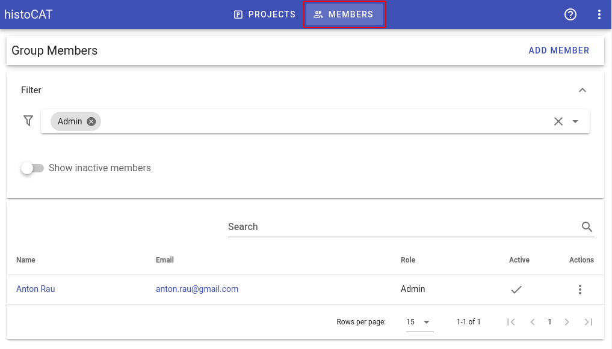
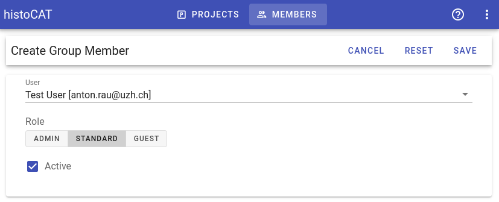

# Groups

Groups allow users to combine relevant projects together and share content among group members. 

Groups can be private or public:

* **Private group**: only group admin can add new members. Group is hidden in the groups overview for non-members.
* **Public group**: any registered user may join the group. Group is visible in groups overview for all users.

In order to create a new group, please click round `Add` button :

_Name_ field is required and _Description_ and _URL_ are optional.

!!! info "Info"
    If you are going to manage multiple groups, we suggest assigning some relevant tags in order to simplify groups filtering.

## Group members

When user creates a new group, he automatically assigned as the group's administrator.
Group admin can manage group members by clicking `Members` button on the top toolbar.

In order to add new group member, please click **Add Member** button and select an entry from the list of registered histoCAT users. Then set member role: group admin, standard user or guest account:

1. **Admin**: can add/remove group members and manage existing projects in the group. Has all available permissions on the group level.
2. **Standard**: Can access all group's projects, upload slides and datasets. Can use data processing pipeline.
3. **Guest**: Can view existing projects/slides/datasets, but cannot add/edit/remove any entries.

!!! info "Info"
    Deselecting **Active** check-box disables access to the group for the selected user.

To switch to project list view, please click `Projects` button on the top toolbar.
