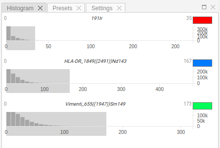

# Histogram

To optimize the appearance of the image, adjust channel settings in `Histogram` panel.
Channel settings apply to selected channels; settings for each channel must be adjusted individually.
These changes will be reflected in `Image` and `Tiles` views.

!!! info "Info"
    Channel intensity ranges and colors are local settings. When you access the slides from another computer, you have to set them again. If you would like to store these settings or share them with other group members, please consider **Presets** functionality.

Each channel in settings view is represented as a separate widget, which contains a histogram of intensity levels and a color picker to select channel's color.
In order to change min/max intensity range, please move left/right border of the gray selection.
These settings are applied depending on tags name, i.e. when you select another acquisition from the `Slides` view, the intensity ranges and colors will persist.

!!! info "Info"
    Clicking outside the selection area will reset min/max range to default values.
