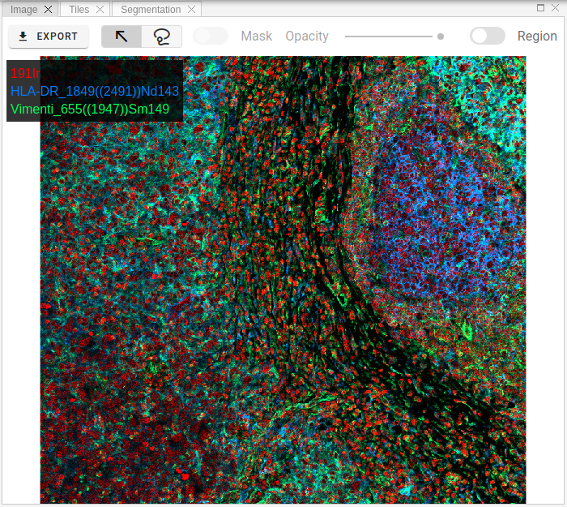
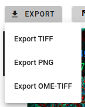
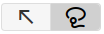

# Image

Image view visualizes channels selected in the Channels view, as well as displays an overlay of segmentation masks.
Zoom/panning functionality supported.

Raster images can be exported in TIFF, OME-TIFF or PNG formats by clicking Export button:  

One useful feature is to get channels statistics for a selected region.
To activate this behavior, please switch **Region** toggle button and then select some area on the raster image using mouse by holding _SHIFT_ key or by selecting `Lasso` tool .
As soon as you release left mouse button, you will get general statistics (min/max/mean intensities) for the selected area for all available channels.
This information is shown in Region panel (see related section in documentation).

!!! info "Info"
    Mask overlay and its opacity controlled by these toolbar elements:
     
