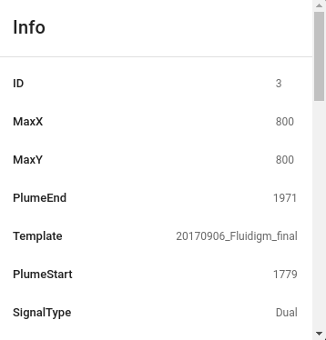
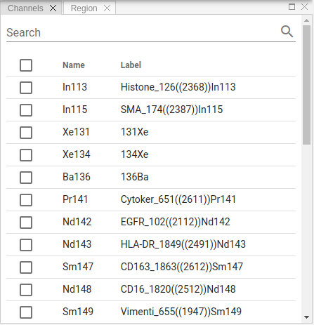
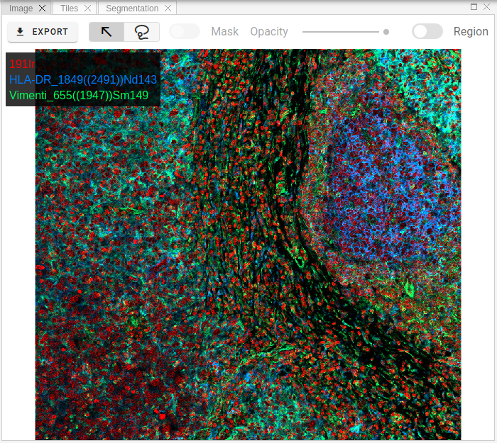

# Imaging

Use of HistoCAT Web typically involves the following steps.
Briefly, users first import raw imaging data and visualize multiplexed images in the viewer.
Second, they may apply segmentation masks and make single-cell measurements (i.e. per-channel mean ion counts, centroid coordinates).
Finally, users can analyse single-cell data via customizable processing pipelines.

Raw image data in the proprietary Fluidigm MCD format is converted into OME-TIFF file format upon uploading to the histoCAT Web server.
Single or multiple metal channels can be shown in the WebGL-accelerated image viewer (Fig. 1a), with corresponding intensity histograms, and image intensity ranges and colors can be adjusted per channel.
Gaussian or mean image filters can be applied to smooth noisy images.
Combinations of these project settings can be saved as presets for later use and shared among group users for reproducible visualization.

## Slides

Slides view represents all uploaded slides in a tree-structured manner, Where each slide can host multiple image acquisitions and panorama images.

The first step is to upload compatible slides files.
Three formats supported at the moment:

* MCD™ files acquired with the Hyperion™ Imaging System and CyTOF® Software 6.7 and later. Such files have `*.mcd` extension. You can also upload zipped MCD files in order to decrease upload size.
* Zipped output of _mcdfolder2imcfolder_ conversion of **imctools v2** library.
* Zipped Fluidigm Imaging Mass Cytometry™ data folders with content similar to the following:

To upload MCD or Zip files please click `Upload Slide` button .

!!! info "Info"
    Processing of the uploaded slide files can take some time. As soon as processing is complete, slide will appear in Slides panel and popup notification message will be displayed.

Slides view represents a tree-like structure of the uploaded slides.
Each slide can contain multiple acquisitions, panorama images and additional metadata.
To check metadata for each entry, whither it is slide image, panorama image or acquisition, please click small Info icon:
 

You should see the popup panel with all available metadata extracted from the raw data, for example:

!!! info "Info"
    Users can delete uploaded slides if needed. To do so please click Delete button in the Slides view:
     

## Channels

As soon as an acquisition is selected in the workspace view, the channel list will be populated.
The channel list displays all channels acquired for the selected acquisitions.

Select one or more channels from the list to show relevant layers in Image panel.
You can sort rows in the channel table, search for specific entries or change custom labels by clicking on it:

!!! info "Info"
    Channel labels changes are global, i.e. visible to all users as they are stored in the database, not locally.

## Image

Image view visualizes channels selected in the Channels view, as well as displays an overlay of segmentation masks.
Zoom/panning functionality supported.

Raster images can be exported in TIFF, OME-TIFF or PNG formats by clicking Export button:  

One useful feature is to get channels statistics for a selected region.
To activate this behavior, please switch **Region** toggle button and then select some area on the raster image using mouse by holding _SHIFT_ key or by selecting `Lasso` tool .
As soon as you release left mouse button, you will get general statistics (min/max/mean intensities) for the selected area for all available channels.
This information is shown in Region panel (see related section in documentation).

!!! info "Info"
    Mask overlay and its opacity controlled by these toolbar elements:
     

## Tiles

In order to view separate channels with according intensities and colorization, one can use tiles image view, where channels presented on the grid layout.

!!! info "Info"
    Any changes to channels settings, like intensity ranges and colors, will be automatically reflected in the tiles view.

## Region statistics

A table in this panel shows region statistics for the selected in `Image` view area when `Region` toggle button is active.

!!! info "Info"
    You can sort rows of the table or search for specific metal tags.

## Histogram

To optimize the appearance of the image, adjust channel settings in `Histogram` panel.
Channel settings apply to selected channels; settings for each channel must be adjusted individually.
These changes will be reflected in `Image` and `Tiles` views.

!!! info "Info"
    Channel intensity ranges and colors are local settings. When you access the slides from another computer, you have to set them again. If you would like to store these settings or share them with other group members, please consider **Presets** functionality.

Each channel in settings view is represented as a separate widget, which contains a histogram of intensity levels and a color picker to select channel's color.
In order to change min/max intensity range, please move left/right border of the gray selection.
These settings are applied depending on tags name, i.e. when you select another acquisition from the `Slides` view, the intensity ranges and colors will persist.

!!! info "Info"
    Clicking outside the selection area will reset min/max range to default values.

## Presets

Project presets allow to store channel settings (intensity range and color per channel) so that they are accessible from other computers or by other members of the group. Another benefit is that you can quickly switch between different visualization schemes to highlight specific regions on slide images.

To apply preset, please click **Apply** button , to delete preset use **Delete** button:   

## Settings

Settings view allows users to control some image viewer parameters. The following options are available:

### Legend

### Scalebar
 

### Filter
 

!!! info "Info"
    Filter has two types: Gaussian and Median. If you have a noisy image, applying filter may improve visual quality.
