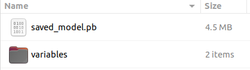
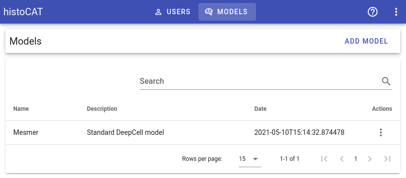

# Models

!!! warning "Warning"
    This section is relevant to super-admin users only!

Before running DeepCell automatic cell segmentation, compatible models should be uploaded to histoCAT.
Because these models are available to all user groups, only super-admins can manage them.

!!! important "Important"
    Please make sure that uploaded models are compatible with a standard TensorFlow model storage format!

In order to upload the model, please create a `.zip` archive that has its content looking similar to the following file structure:

!!! info "Info"
    At the time of the writing, the latest DeepCell Mesmer model can be downloaded here: [https://deepcell-data.s3-us-west-1.amazonaws.com/saved-models/MultiplexSegmentation-7.tar.gz](https://deepcell-data.s3-us-west-1.amazonaws.com/saved-models/MultiplexSegmentation-7.tar.gz)

Super-admin user can manage existing models or upload a new one by clicking `Models` button:

