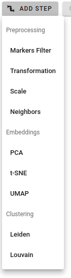

# Pipelines

When a proper dataset is uploaded and selected in the Datasets panel, then users can run single-cell data analysis on them. **Pipeline** consists of several processing steps that reflect the output user wants to get as a result. You can run the same pipeline on different datasets, different acquisitions as many time as you wish. All processing outputs are stored as **Results** (see next documentation section).

At the beginning, user needs to design processing pipeline in visual pipeline editor. The processing flow is from top to bottom:

First, select a step you want to add from the list of available processing steps:

There are three pipeline step categories:

* **Preprocessing**: such actions as marker filtering, data transformation, scaling, etc.
* **Embeddings**: dimensionality reduction via PCA, t-SNE, UMAP
* **Clustering**: community detection by Louvain or Leiden algorithms

Each step has his own sets of parameters. By clicking on parameter field you can see its short description:

One can change step order in a pipeline by clicking **Up** / **Down** arrow buttons or delete it:   

!!! warning "Warning"
    Some steps require additional steps defined beforehand in the pipeline to run properly. For instance, UMAP embedding or any clustering step needs Neighborhood graph detection step defined upper in the pipeline. If you miss such steps, there will be a warning message preventing the submission to processing.

As soon as pipeline is complete, you can submit it to back-end for a processing by background workers. After clicking  button, a dialog window will appear where one can select acquisitions that have to be analysed by the pipeline:

Depending on the pipeline's complexity, processing can take some time. For example, t-SNE / UMAP or clustering detection are quite long-running processes. When processing is complete, there will be a notification message and the analysis result will appear in the **Results** view (please see next section in documentation).

In case you want to re-use a pipeline in the future or to share it with other group members, it can be saved in the Pipelines tab by clicking **Save Pipeline** button:

At any moment you can rename saved pipeline, give it some description or delete it altogether. To load stored pipeline please click Load Pipeline button:  
