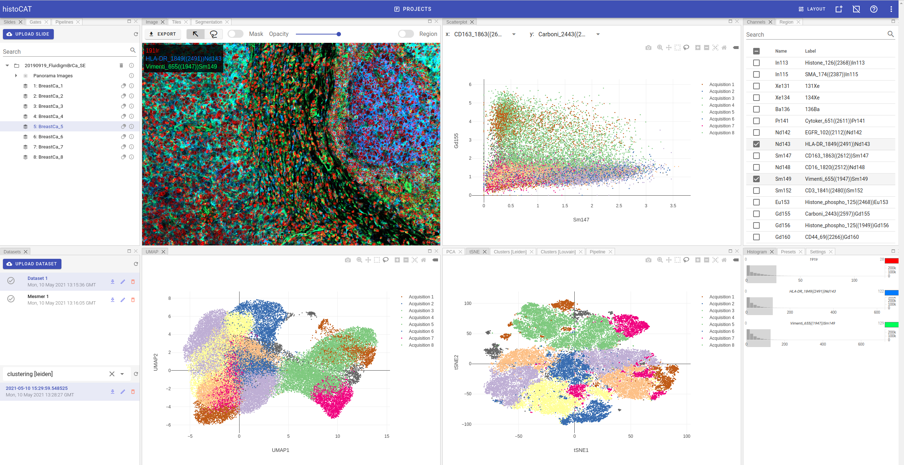

# Overview

Most of the time you'll spend in `Project` view.
It provides all tools for raster image and plots visualisation, supports bi-directional gating and give access to cell segmentation and single-cell data analysis.

Project view layout has the following panels:

- Slides
- Datasets
- Gates
- Pipelines  
- Image
- Tiles
- Segmentation
- Channels
- Region
- Histogram
- Presets
- Settings
- Scatterplot
- PCA
- tSNE
- UMAP
- Clusters
- Pipeline
