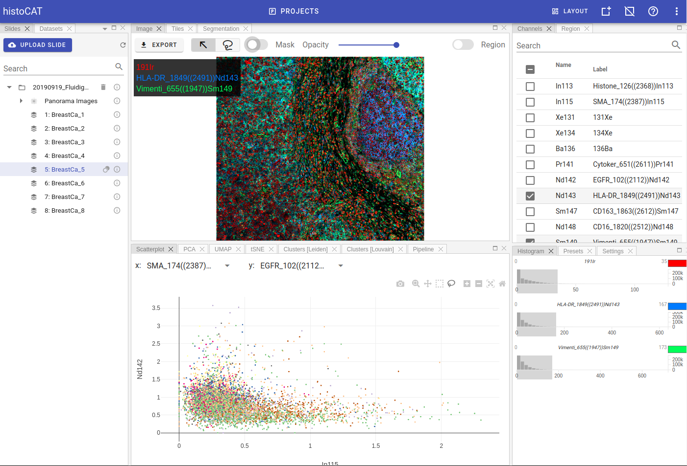

# Overview

Most of the time you'll spend in `Project` view.
It provides all tools for raster image and plots visualisation, supports bi-directional gating and give access to cell segmentation and single-cell data analysis.

## Layout management

histoCAT Web provides quite flexible layout mechanism, where each panel can be easily resized, moved, hidden or docked into groups of panels.
Moreover, users can save multiple layout presets and switch between them on the fly. `Default` layout is always present and cannot be deleted.
If you ever delete a panel and cannot find it anymore, you just need to switch to `Default` layout, where all panels are present at the same time, and use it as a starting point to construct new layout according to your needs.

Here is how `Default` layout looks like:

To manage layouts please use controls at the top-right part of the screen:

`Layout` dropbox menu shows all available layouts. By clicking any element in the menu, you can load that layout.
`Save layout` button opens a dialog where one can name the layout and save it for further use.
`Reset layouts` button deletes all saved layouts and switch back to `Default` layout.

!!! info "Info"
    You can use `Reset layouts` button in case you removed some panels by accident, because `Default` layout displays all available panels in the project workspace. 

## Available panels

Project workspace layout has the following panels:

- Slides
- Datasets
- Gates
- Pipelines  
- Image
- Tiles
- Segmentation
- Channels
- Region
- Histogram
- Presets
- Settings
- Scatterplot
- PCA
- tSNE
- UMAP
- Clusters
- Pipeline
