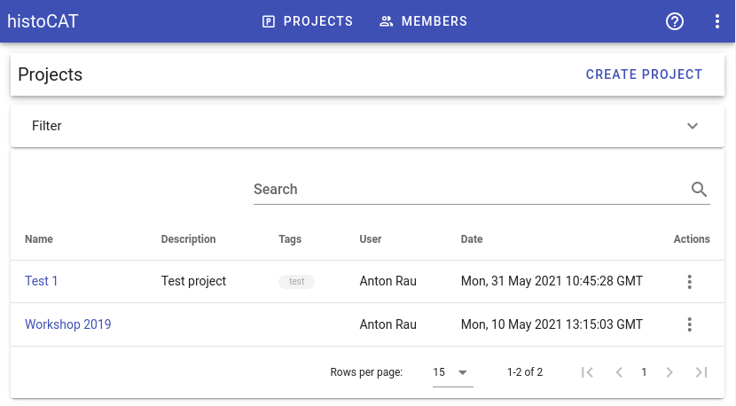
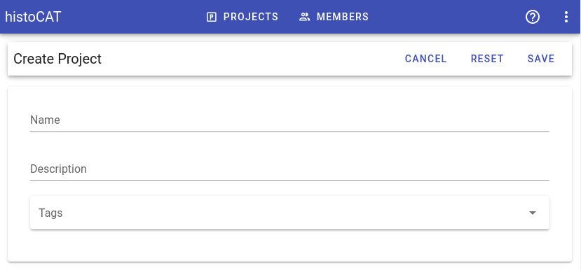
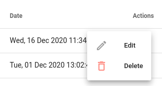

# Projects

Projects serve as containers for slides and datasets. User can create as many projects as he sees fit. User presets can be stored on per-project level and are shared among group members.

In order to create a new project, please click **Create Project** button. You will see the following editor:

!!! info "Info"
    It is recommended to assign some relevant tags in order to simplify projects filtering.

One can open a project by clicking its name in the projects list. Project-level actions are available under three-dot menu:  

### Project modes

As soon as project is opened, there are two view modes available:

* **Image**: in this mode users can upload and visualize slides images.
* **Data**: in this mode users can analyze single-cell data and run processing pipelines.

To switch between these modes please use project sidebar at the left:

