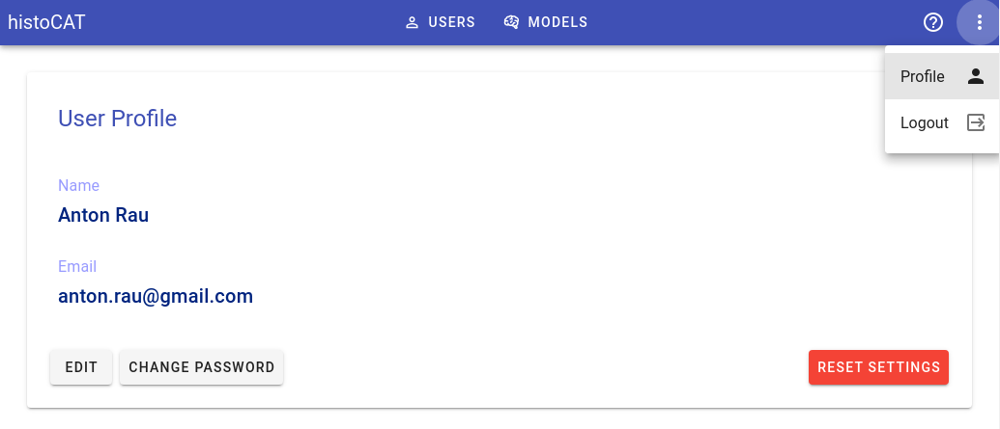

# Registration

In order to use histoCAT please register an account. The first time user tries to access histoCAT web application, he will be greeted with a login dialog.

To create a new account, please click "Register an account" link there.

!!! info "Info"
    You should get a confirmation email. Please click a link in the email in order to complete registration process.

Later on, the user can edit his profile / password in Profile view:

