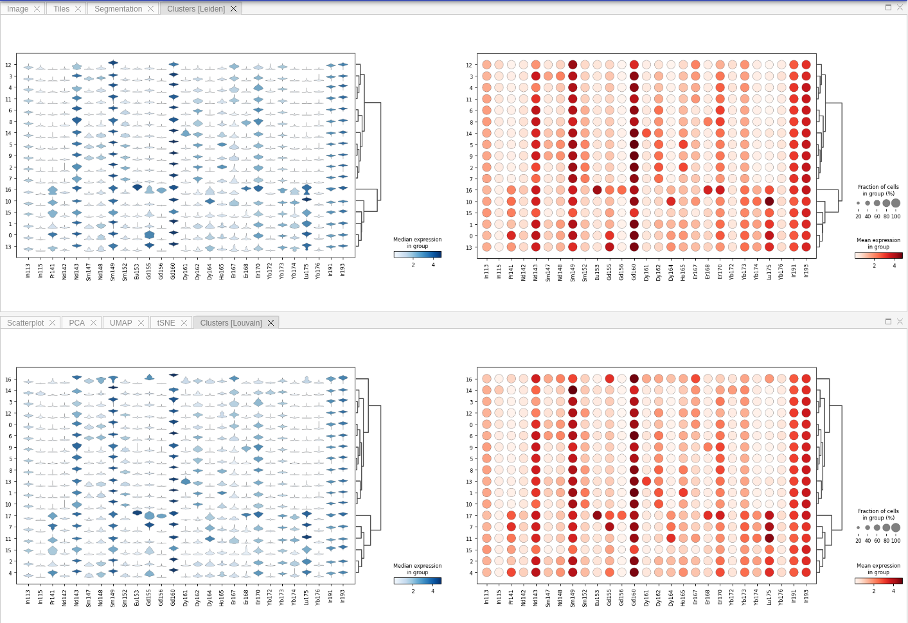

# Results

All results of individual pipeline runs are grouped in **Results** tab. By default their name is represented by timestamp of when the processing was complete.

!!! info "Info"
    Please keep in mind that result will appear in the list only when processing on the server side is complete, which can take a lot of time (up to hours).

Because results of pipeline data processing are stored in _AnnData_ file format, it is easy to download them and continue further analysis on the client side. To download result as a zip archive, please click **Download** button:  

Other available commands are: **Load** result, **Edit** result and **Delete** result. By selecting **Edit** command user can give a custom, meaningful name and description to the result entry instead of the automatically assigned name (which is a timestamp by default).

!!! info "Info"
    Result also stores the whole pipeline that has been used for its processing so you can easily check which parameters were used for analysis or adjust these parameters and re-run pipeline in order to get new result.

Depending on the pipeline design, after loading result user will see Scatter, PCA, t-SNE and UMAP plots in the Result tab view:

!!! info "Info"
    Scatter plot allows user to select markers on X and Y axes and display correlation between them on a 2D-scatterplot.

If you ran community detection in your pipeline, then additional tab called Clustering will appear. There you may see violin and dot plots for Leiden / Louvain clustering:

