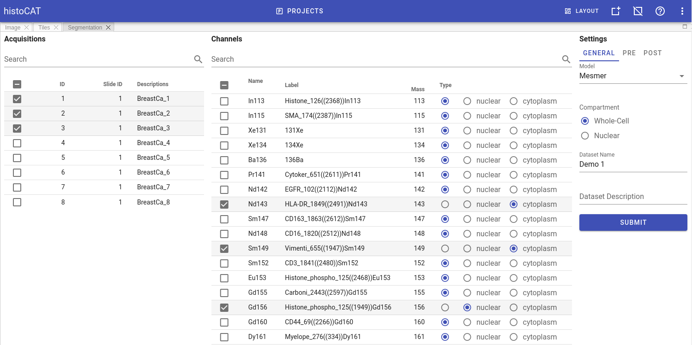
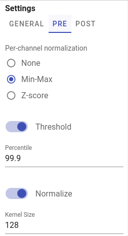
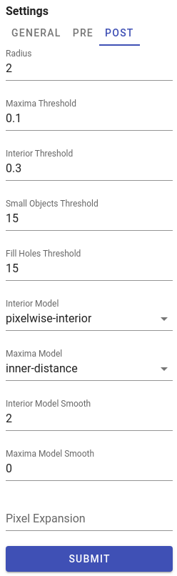

# Segmentation

[DeepCell](https://github.com/vanvalenlab/deepcell-tf) is a deep learning library for single-cell analysis of biological images.
Pre-trained DeepCell [Mesmer](https://github.com/vanvalenlab/intro-to-deepcell/tree/master/pretrained_models#mesmer-segmentation-model) model used for cell/nuclei segmentation from raw image data.

!!! note "Note"
    Super-admin users can upload new models in addition to a default DeepCell Mesmer model.

Automatic DeepCell segmentation in histoCAT Web will create grayscale cell/nuclear masks of the same x and y dimensions as the original images, containing unique pixel values for each cell/nucleus.
Mean cell intensities and cell centroid coordinates measured as well.

!!! note "Note"
    Depending on the application, DeepCell requires images of specific dimensions. For example, in the case of cell segmentation using Mesmer, DeepCell expects two-channel images as input, where the first channel must be a nuclear channel (e.g., DAPI) and the second channel must be a membrane or cytoplasmic channel (e.g., E-Cadherin).

To run DeepCell segmentation, please follow these steps:

1. Switch to `Segmentation` panel in Project workspace.
2. Select acquisitions which should be analysed in order to acquire their segmentation masks and to measure cell-specific data. Channels panel will be populated with metal channels of the selected acquisitions.
3. Select channels of two types: nuclear and cytoplasm channels. If multiple channels of the same type selected, they will be merged into a two-channel image, compatible with DeepCell Mesmer input format. Channels that do have type `None` are excluded from segmentation.
4. In `GENERAL` tab at the right part of the `Segmentation` panel select a model, type of segmentation (whole-cell or nuclear), and give a proper name and description for dataset that will be generated.
5. Adjust DeepCell pre- and post- processing settings if needed (these settings located in `PRE` and `POST` tabs). For details see [DeepCell settings](https://deepcell.readthedocs.io/en/stable/_modules/deepcell/applications/mesmer.html#Mesmer.predict)
6. When ready, click `SUBMIT` button to start segmentation processing on the server side.

## Pre-processing settings

!!! note "Channel-wise image normalization"
    If `Min-Max` or `Z-score` per-channel normalization enabled in `PRE` tab, channels intensities are [scaled](https://en.wikipedia.org/wiki/Feature_scaling) for each channel independently before merging them into two-channel input image.

## Post-processing settings

