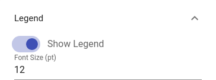
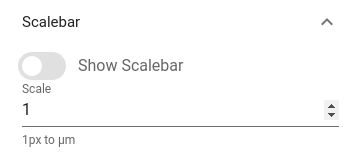
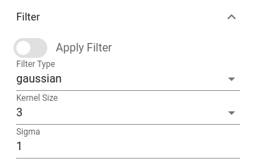

# Settings

Settings view allows users to control some image viewer parameters. The following options are available:

## Legend

## Scalebar
 

## Filter
 

!!! info "Info"
    Filter has two types: Gaussian and Median. If you have a noisy image, applying filter may improve visual quality.
