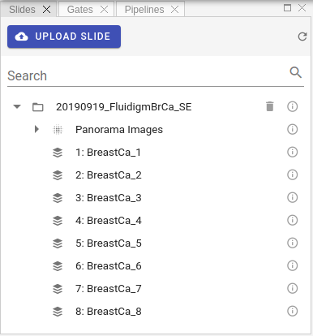

# Slides

Slides view represents all uploaded slides in a tree-structured manner, Where each slide can host multiple image acquisitions and panorama images.

The first step is to upload compatible slides files.
Three formats supported at the moment:

* MCD™ files acquired with the Hyperion™ Imaging System and CyTOF® Software 6.7 and later. Such files have `*.mcd` extension. You can also upload zipped MCD files in order to decrease upload size.
* Zipped output of _mcdfolder2imcfolder_ conversion of **imctools v2** library.
* Zipped Fluidigm Imaging Mass Cytometry™ data folders with content similar to the following:

To upload MCD or Zip files please click `Upload Slide` button .

!!! info "Info"
    Processing of the uploaded slide files can take some time. As soon as processing is complete, slide will appear in Slides panel and popup notification message will be displayed.

Slides view represents a tree-like structure of the uploaded slides.
Each slide can contain multiple acquisitions, panorama images and additional metadata.
To check metadata for each entry, whither it is slide image, panorama image or acquisition, please click small Info icon:
 

You should see the popup panel with all available metadata extracted from the raw data, for example:

!!! info "Info"
    Users can delete uploaded slides if needed. To do so please click Delete button in the Slides view:
     
