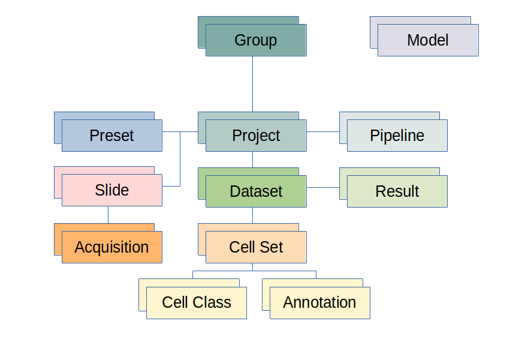

# Organisational structure

Main organisational unit in histoCAT is a user group.
After registering an account, users can create new groups or join existing public groups.

Each user group can host multiple projects.
Project can be viewed as a collection of slides with according single-cell datasets.
Group members have access to all group data, such as projects, datasets, slides, presets, etc.

!!! info "Info"
    DeepCell models (like Mesmer) are available across all groups and can be uploaded and managed by histoCAT super-admin.
