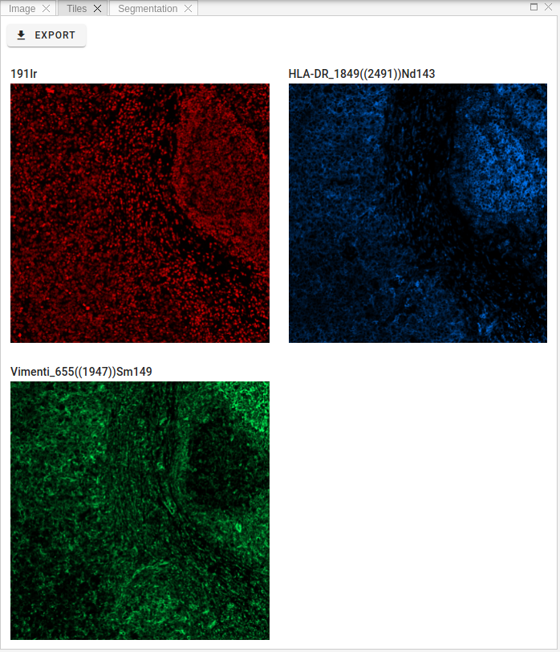

# Tiles View

In order to view separate channels with according intensities and colorization, one can use tiles image view, where channels presented on the grid layout.

!!! info "Info"
    Any changes to channels settings, like intensity ranges and colors, will be automatically reflected in the tiles view.
