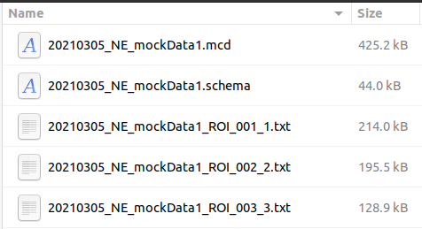

# Workspace View

Main purpose of the Image mode is to visualize slides images. The first step is to upload compatible slides files. Three slide formats are supported at the moment:

* MCD™ files acquired with the Hyperion™ Imaging System and CyTOF® Software 6.7 and later
* Output of _mcdfolder2imcfolder_ conversion of **imctools v2** library
* Zipped Fluidigm Imaging Mass Cytometry™ data folders with content similar to the following:

To upload MCD or Zip files please click Upload Slide button:  in Image view mode.

!!! info "Info"
    Processing of the uploaded slide files can take some time. As soon as processing is complete, slide will appear in Workspace panel and popup notification message will be displayed.

Workspace view represents a tree-like structure of the uploaded slides. Each slide can contain multiple acquisitions, panorama images and additional metadata. To check metadata for each entry, whither it is slide image, panorama image or acquisition, please click small Info icon:  

You should see the popup panel with all available metadata extracted from the raw data, for example:

!!! info "Info"
    If you have limited screen space, you can hide unnecessary panels by clicking Hide workspace or Hide options buttons in the header panel: 

Users can delete uploaded slides if needed. To do so please click Delete button in Workspace view:  
